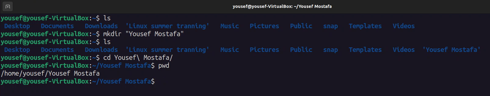
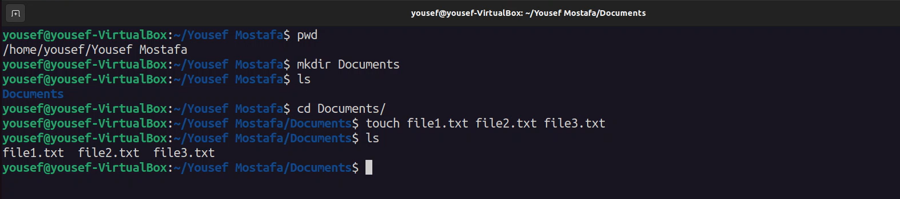
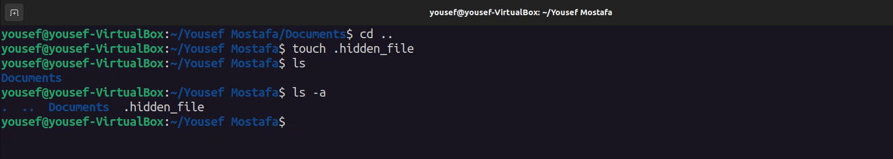
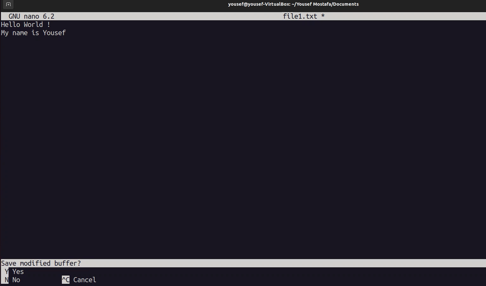
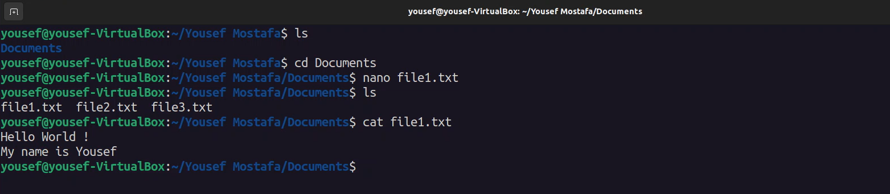
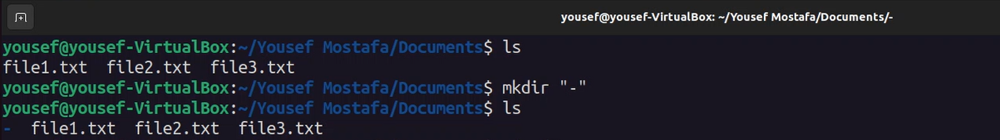
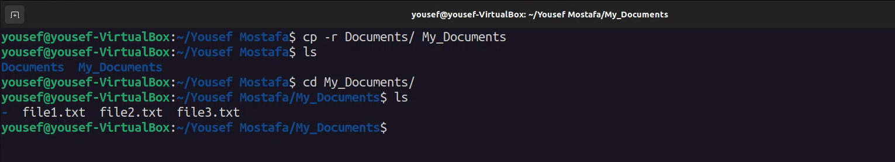
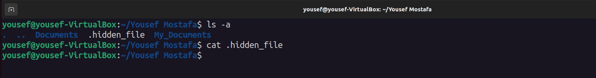
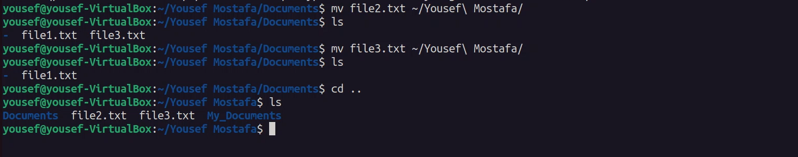
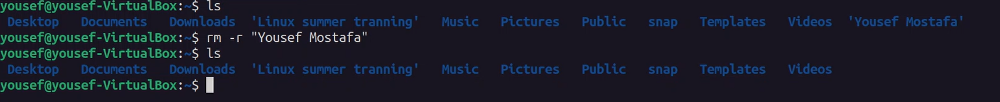

# Task one

## 1. Create Directory

```
mkdir "Yousef Mostafa"

cd Yousef\ Mostafa/
```
>image


## 2. Another Directory and Files

```
mkdir Documents

cd Documents

touch file1.txt file2.txt file3.txt

ls
```
>image


## 3. Hide a File

```
cd ..

touch .hidden_file

ls -a
```
>image


## 4. Write with Nano

```
nano file1.txt

cat file1.txt

```
>image



## 5. go back

```
cd ..

```
## 6. Create a Unique Dirctory

```
mkdir "-"

cd Documents/-/

```
>image



## 7. Copy Directory

```
cp -r Documents My_Documnts
ls

cd My_Documents
ls

```
>image


## 8. show Hidden Files

```
ls -a 

```
>image


## 9. Move files

```
mv file2.txt ~/Yousef\ Mostafa/
ls

mv file3.txt ~/Yousef\ Mostafa/
ls

cd..
ls
```
>image


## 10. Remove your Directory

```
ls

rm -r "Yousef Mostafa"
ls

```
>image


