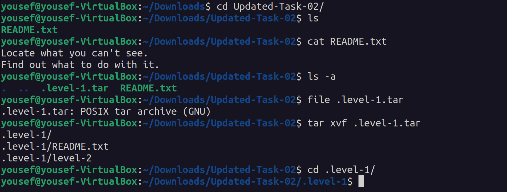
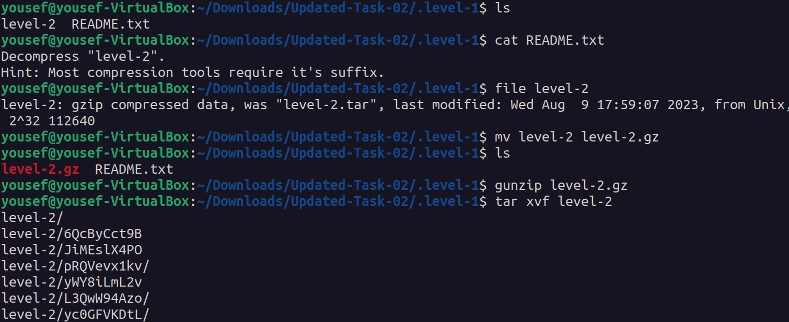
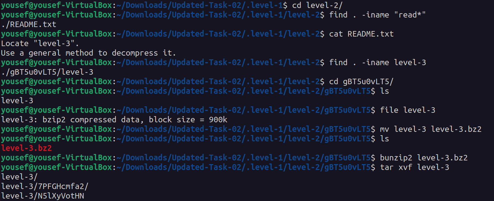
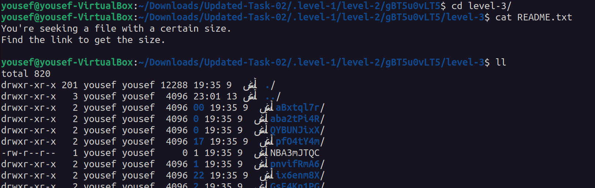
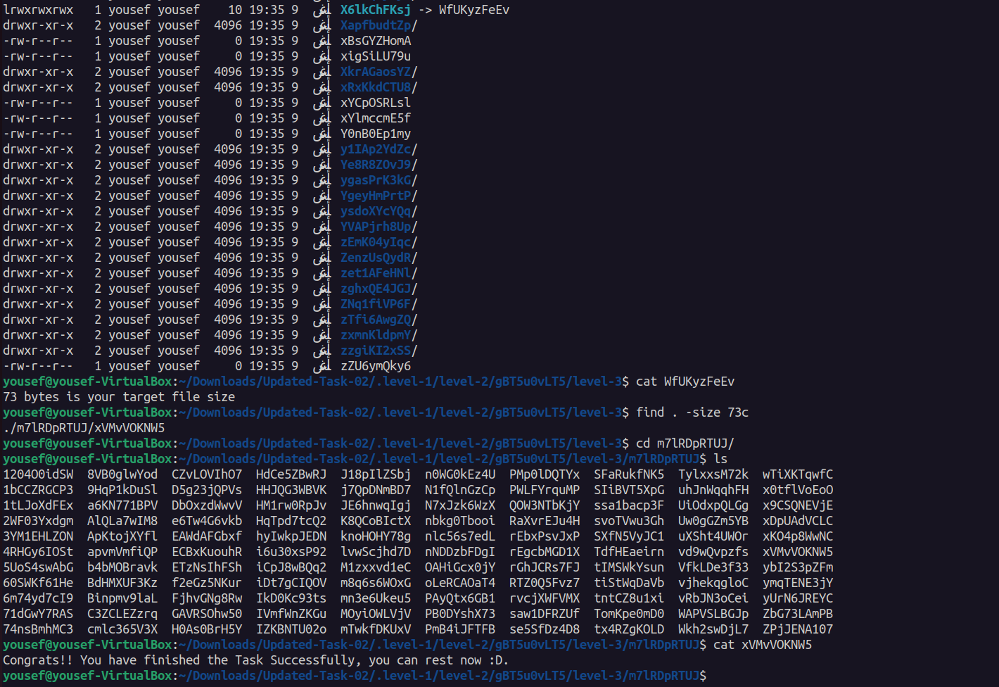

# Second task

## 1. level-1

```
cd Updated-Task-02/
ls

cat README.txt
ls -a
file .level.tar

tar xvf .level-1.tar
cd .level-1/
```
>image


## 2. level-2

```
cat README.txt
file level-2

mv level-2 level-2.gz
gunzip level-2.gz
tar xvf level-2

cd level-2/
```
>image


## 3. level-3

```
find . -iname "read*"
cat README.txt

find . -iname level-3
cd gBTSu0vLT5/
file level-3

mv level-3 level-3.bz2
bunzip2 level-3.bz2
tar xvf level-3

cd level-3/
```
>image


## 4. level-4 

```
cat README.txt
ll

cat WfUKyzFeEv
find . -size 73c
cd m7lRDpRTUj/
cat xVMvV0KNW5

```
>image


