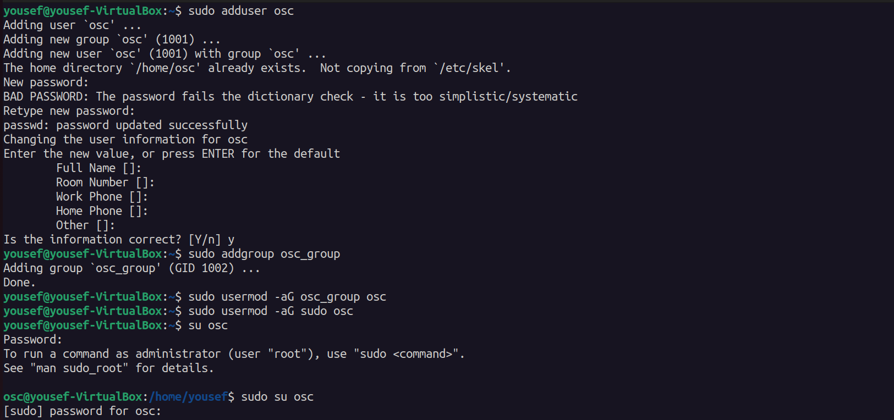
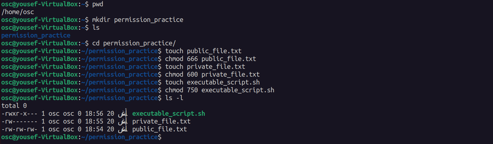
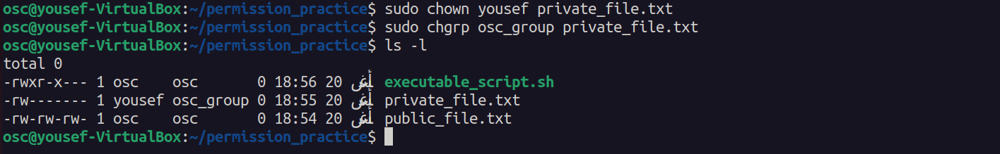
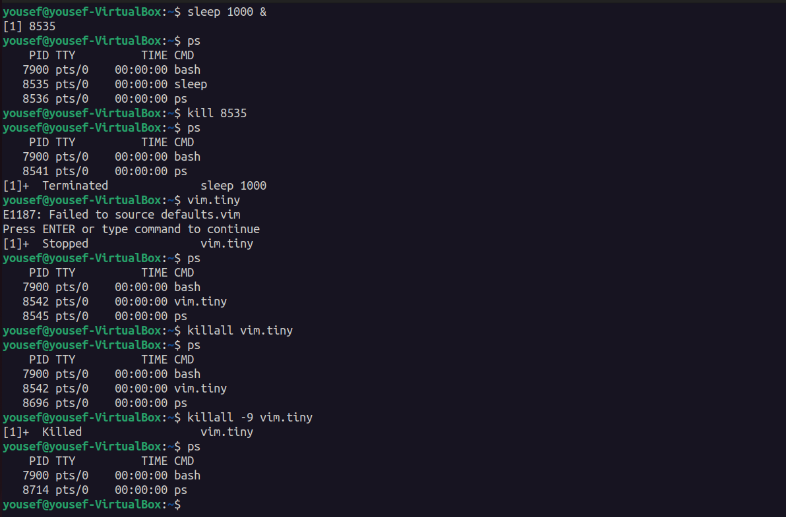
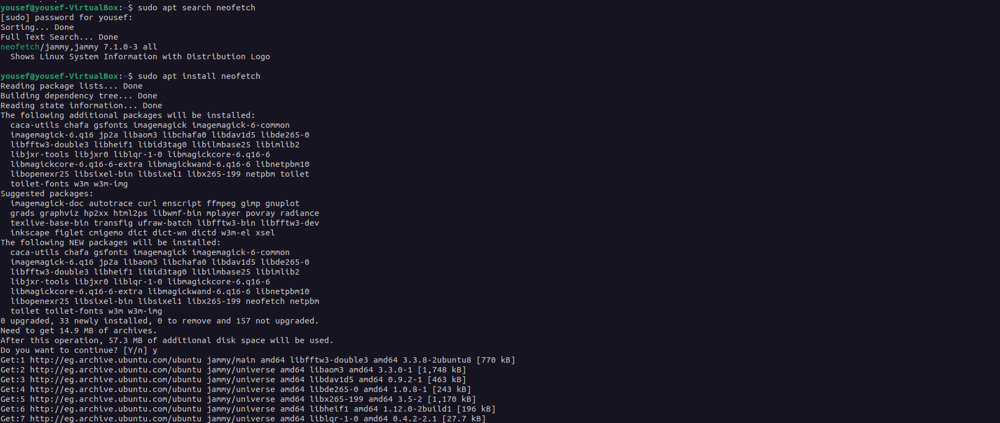
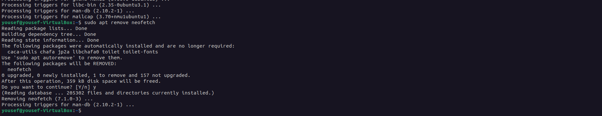

# Task 3

## 1. Create a new user and gruop

```
sudo adduser osc

sudo addgroup asc_group

sudo addgroup -aG osc_group osc

sudo addgroup -aG sudo osc

sudo su osc
```
>image-1


## 2. Change the permissions of a file

```
mkdir permission_practice
cd permission_practice/

touch public_file.txt
chmod 666 public_file.txt

touch private_file.txt
chmod 600 private_file.txt

touch executable_script.sh
chmod 750 executable_script.sh

ls -l
```
>image-2


## 3. Change the owner of a file

```
sudo chown yousef private_file.txt

sudo chgrp osc_group private_file.txt

ls -l

```
>image-3


## 4. Process management 

```
sleep 1000 &
kill 8535

vim.tiny
killall -9 vim.tiny

ps
```
>image-4


## 5. Package management

```
sudo apt install neofetch

sudo apt remove neofetch
```
>image-5



